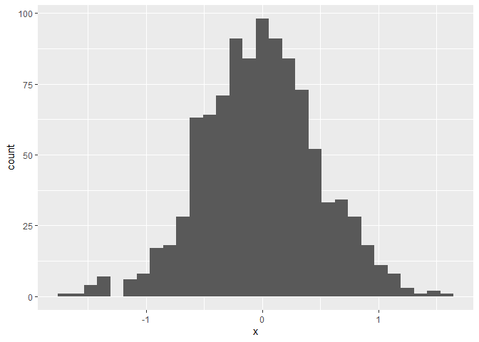

Homework 1 - P8105
================
Tim Hauser (th2899)
2022-09-23

The purpose of this file is to document the steps to fulfill Homework 1.

## Problem 1

Load the Penguins dataset

``` r
data("penguins", package = "palmerpenguins")
```

The 344 (rows) by 8 (columns) penguins dataset is a list of penguins
with the following eight variables collected for each (if available):
bill_depth_mm, bill_length_mm, body_mass_g, flipper_length_mm, island,
sex, species, year.

The mean flipper length across all penguins in the data set is 200.915
mm. As a side note, in the mean calculation I ignored the NA value in
row 4, because R by default returns a mean of NA if the data contains at
least one NA.

Below is displayed a scatterplot with `flipper_length_mm` on the Y axis
and `bill_length_mm` on the X axis, colored by `species`:

``` r
ggplot(penguins, aes(x = bill_length_mm, y = flipper_length_mm, color = species)) + geom_point()
```

    ## Warning: Removed 2 rows containing missing values (geom_point).

<!-- -->

``` r
ggsave("scatter_plot.pdf", height = 4, width = 6) 
```

    ## Warning: Removed 2 rows containing missing values (geom_point).

First we create a dataframe containing variables for our plots.

``` r
set.seed(1234)

plot_df = tibble(
  x = rnorm(1000, sd = .5),
  y = 1 + 2 * x + rnorm(1000)
)
```

First we show a histogram of the `x` variable.

``` r
ggplot(plot_df, aes(x = x)) + geom_histogram()
```

    ## `stat_bin()` using `bins = 30`. Pick better value with `binwidth`.

<!-- -->

Next we show a scatterplot of `y` vs `x`.
